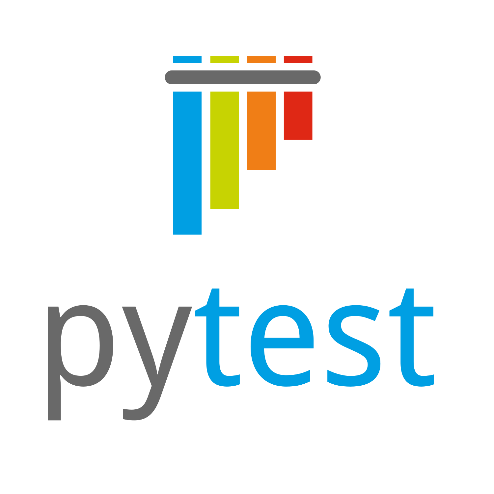

# Empieza a testear tus proyectos de Python con Pytest



Pytest es un framework de testing para python similar a unittest pero con algunas mejoras, entre ellas:
- detección automatica de tests, encontrará automaticamente los tests de nuestro proyecto.
- Permite ejecutarse facilmente desde la terminal simplmente con el comando `pytest`
- Tiene una sintaxis bastante sencilla.
- Permite elegir como de completos queremos que sean los logs de los errores.

## Instalación se instala como cualquier paquete de Python usando pip.

```bash
pip install pytest
```
Esto nos instalara pytest en la terminal y como un paquete de python.

## Crear nuestro primer tests.

### Aserciones

Creamos un nuevo proyecto en Python, si no lo tenemos creado ya y en la raiz del proyecto, donde esta el .gitignore, el .env..., creamos una carpeta que se llame `tests`, tiene que llamarse asi para que pytest la reconozca y dentro de ella creamos un modulo que se llame `test_operaciones.py`
> [!WARNING]
> TODOS los modulos que sean tests y todos los tests deben empezar por `test_` para que pytest los reconozca

Dentro de ese modulo importamos pytest y creamos una función llamada `test_suma_tres_cinco`

```python
def test_suma_tres_cinco():
    resultado = 3 + 5
```

De momento esto es una funcion normal, simplemente suma 2 números que dan como resultado 8. pero... ¿Sabemos si el resultado es 8? Es decir es matematica muy basica, pero en la programación nada es seguro hasta que se prueba, justo debajo añadimos una linea que diga `asset resultado == 8`

```python
def test_suma_tres_cinco():
    resultado = 3 + 5
    assert resultado == 8
```

Si ahora ejecutamos en la terminal:

``` bash
pytest
```

Si los test son correctos veremos algo asi. Lo que nos importa es la ultima linea '1 passed' es decir nuestro programa ha pasado el test
```
==================================================== test session starts ====================================================
platform win32 -- Python 3.14.7, pytest-9.1.1, pluggy-1.6.0
rootdir: D:\Clases_Carlos\IFCD0112-Pytest
configfile: pyproject.toml
collected 1 item                                                                                                            

tests\test_operaciones.py .                                                                                            [100%]

===================================================== 1 passed in 0.04s =====================================================
```

Si en lugar de `pytest` usamos esto le estamos diciendo que queremos un resultado mas "verbose" si no te suena esta palabra es ser mas detallado:

```
pytest -v
```
Aqui vemos explicitamente que test se estan ejecutando y si pasan o no, si algún test concreto falla podemos verlo facilmente aqui.
```
==================================================== test session starts ====================================================
platform win32 -- Python 3.14.7, pytest-9.1.1, pluggy-1.6.0 -- D:\Clases_Carlos\IFCD0112-Pytest\.venv\Scripts\python.exe
cachedir: .pytest_cache
rootdir: D:\Clases_Carlos\IFCD0112-Pytest
configfile: pyproject.toml
collected 1 item                                                                                                             

tests/test_operaciones.py::test_suma_tres_cinco PASSED                                                                 [100%]

===================================================== 1 passed in 0.06s =====================================================
```
> [!NOTE]
> Si solo deseamos ejecutar un modulo en concreto podemos pasarle la ruta del modulo como parametro dentro de la función a pytest. `pytest .\tests\test_operaciones.py`
> 
> Si además queremos ejecutar un  unico test de un modulo concreto se lo podemos indicar con la misma forma que nos lo muestra al devolverlo `tests/test_operaciones.py::test_suma_tres_cinco`

### Excepciones

No solo podemos controlar que se ha devuelto un valor correcto, tambien podemos comprobar que se ha lanzado una excepción determinada, esto nos permitira saber si el programa falla o si esta lanzando la excepción correcta, dentro del mismo fichero de tests crea el siguiente test:

```python
def test_dividir_diez_cero():
    with pytest.raises(ZeroDivisionError):
        resultado = 10 / 0
```

Python tiene una excepción que salta cuando intentas dividir por 0, este test comprueba que efectivamente salta esa excepción, pruebalo con:

```bash
pytest tests/test_operaciones.py::test_dividir_diez_cero -v
```

## Pruebas en un software real.

De momento solo hemos hecho unas pruebas extremadamente básicas, no hemos probado nada real, asi que vamos a crear un pequeño software que vamos a testear, es un simple gestor de usuarios, en el mismo sitio que la carpeta test crea una carpeta llamada src y dentro un modulo llamado models.py (como el que hay en la configuración de DJango)

Los requisitos de nuestro sistema son los siguientes:

- El nombre del usuario debe ir entre los 8 y 16 caracteres.
- El correo debe cumplir con lo que se espera de una dirección de correo.
- La contraseña debe tener una minuscula, una mayuscula, un numero y un caracter no alfanumerico.

```python
class User: # creamos la clase User para representar a un usuario
    def __init__(self, username: str, email: str, password: str): # definimos el método __init__ que se ejecuta al crear un objeto de la clase User
        if not 8 <= len(username) <= 16:
            raise ValueError("El usuario debe tener entre 8 y 16 caracteres") # validamos que el nombre de usuario tenga entre 8 y 16 caracteres, si no es así, lanzamos un ValueError con un mensaje de error

        if not re.fullmatch(r"[^@\s]+@[^@\s]+\.[^@\s]+", email): # validamos que el correo electrónico tenga un formato válido usando una expresión regular, si no es así, lanzamos un ValueError con un mensaje de error
            raise ValueError("El email no es válido")

        if ( # validamos que la contraseña cumpla con los requisitos de seguridad, si no es así, lanzamos un ValueError con un mensaje de error
            not any(character.isupper() for character in password)
            or not any(character.islower() for character in password)
            or not any(character.isdigit() for character in password)
            or not any(not character.isalnum() for character in password)
        ): 
            raise ValueError( # lanzamos un ValueError con un mensaje de error si la contraseña no cumple con los requisitos de seguridad
                "La contraseña debe contener mayúsculas, minúsculas, "
                "números y caracteres especiales"
            )

        # Si todas las validaciones pasan, asignamos los valores de los parámetros a los atributos del objeto User
        self.username = username
        self.email = email
        self.password = password

    def __repr__(self): # definimos el método __repr__ que devuelve una representación en cadena del objeto User
        return f"Usuario: {self.username}\nEmail: {self.email}\nContraseña: {self.password}"
```

Este código funciona, pero no lo podemos saber si probarlo, podriamos tirarnos el dia entero probando, y si no tiene una mayuscula y si no tiene el @. Es mejor automatizar todo eso. dentro de tests creamos otro modulo llamado `tests_models` y vamos a ir probando los campos uno a uno, como antes importamos Pytest y en este caso la clase que queremos testear y creamos la siguiente función.

```python

import pytest

from ifcd0112_pytest.models import User


def test_user_accepts_valid_data():
    user = User("usuario01", "usuario@example.com", "Clave123!")

    assert user.username == "usuario01"
    assert user.email == "usuario@example.com"
    assert user.password == "Clave123!"

```

Este test comprueba si los atributos del usuario tienen los nombres correctos en y el orden en el construcción, es decir primero el usuario, luego el email y por ultimo la contraseña.

Siguiente test.

```python
@pytest.mark.parametrize("username", ["corto", "a" * 17])
def test_user_rejects_username_outside_length_limits(username):
    with pytest.raises(ValueError, match="entre 8 y 16"):
        User(username, "usuario@example.com", "Clave123!")
```

con `@pytest.mark.parametrize` podemos pasarle a una lista de parametros a probar y ejecutara los tests por cada uno, en este caso le estamos pasando 2 nombres, uno demasiado corto y otro demasiado largo, si salta una excepción el test es correcto.

Siguiente test.

Aqui estamos comprobando que el correo requiere ser un correo completo, en este caso caso tambien se espera que reciba un correo completo

```python
@pytest.mark.parametrize("email", ["usuario", "usuario@example", "@example.com"])
def test_user_rejects_invalid_email(email):
    with pytest.raises(ValueError, match="email"):
        User("usuario01", email, "Clave123!")

```

Siguiente test.

Ahora vamos a testear la constraseña, lo mismo cada caso de la lista es una contraseña que no cumple los requerimientos, por lo cual debe saltar una excepción.

```python
@pytest.mark.parametrize("password",["clave123!", "CLAVE123!", "Claveabc!", "Clave123"],
)
def test_user_rejects_password_without_required_character_type(password):
    with pytest.raises(ValueError, match="contraseña"):
        User("usuario01", "usuario@example.com", password)
```

Siguiente test.

Aqui estamos resteando la salida por teclado, la representación, es la que queremos de manera que si cambiamos la representación da error.

```python
def test_user_printable_representation():
    user = User("usuario01", "usuario@example.com", "Clave123!")
    assert repr(user) == f"Usuario: {user.username}\nEmail: {user.email}\nContraseña: {user.password}"
```

Siguiente test.

Podemos tambien testear funciones de objetos, por ejemplo aqui estamos probando que cuando ejecutamos la función de cambiar efectivamente cambia el nombre de usuario.

```python
def test_change_username_accepts_valid_username():
    user = User("usuario01", "usuario@example.com", "Clave123!")
    user.change_username("nuevoUsuario")
    assert user.username == "nuevoUsuario"
```

Últmo test.

Por último vamos a testear que alguien no intenta cambiarse el nombre de usuario a uno mas corto o mas largo del que deberia.
```python
@pytest.mark.parametrize("new_username", ["corto", "a" * 17])
def test_change_username_rejects_invalid_username(new_username):
    user = User("usuario01", "usuario@example.com", "Clave123!")
    with pytest.raises(ValueError, match="entre 8 y 16"):
        user.change_username(new_username)
```

Esto son las bases del testing, lo ideal sería testear todas las funciones del un software para garantizar que todas funcionan correctamente, estos son los test unitarios, donde testeamos una pequeña parte del codigo.

## Mockear
No obstante estos tests se caracterizan porque deben ser independientes entre ellos e independientes del sistema incluido el propio sistema de archivos o nuestro propio software, por ejemplo si tenemos una base de datos y queremos testear que formatea bien la información recibida, no pretendemos testear la conexión con la base de datos, para tenemos que hacer lo que se lleva. Aprendi esto a las malas. 

Para poder testear esto hacemos lo que se llama "mockear", mockear es pasarle a una función la respuesta que esperamos de una función interna.

